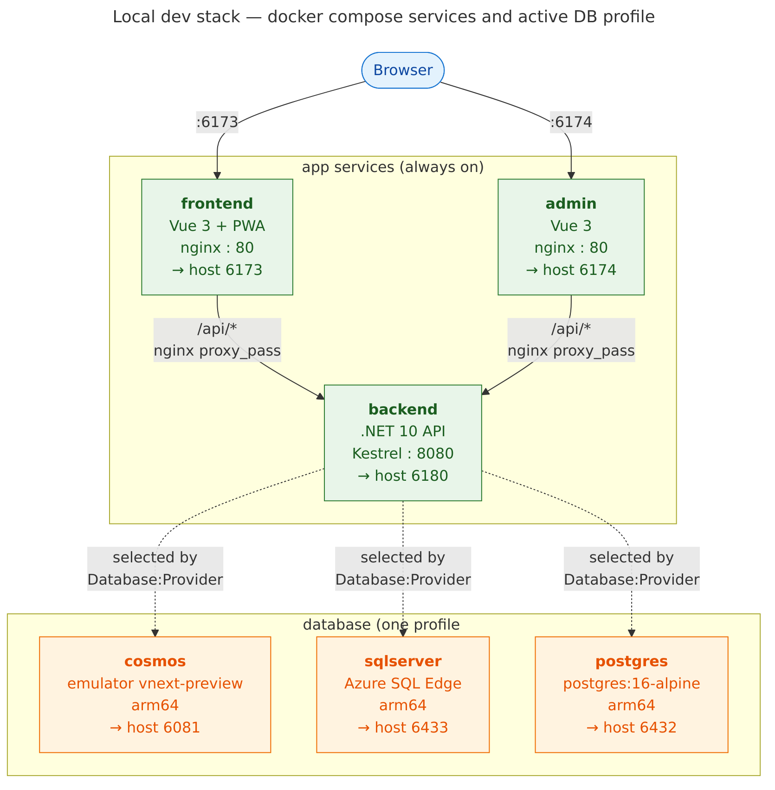

# Project Template

A GitHub template for starting full-stack projects with:

- **frontend/** — Vue 3 + TypeScript + Bun, shadcn-vue, service worker / PWA, containerized.
- **backend/** — C# .NET 10 Web API backed by Cosmos DB, containerized.
- **admin/** — Vue 3 + TypeScript admin UI for viewing and editing DB records.
- **docs/** — Requirements and design documents.
- **infra/** — Terraform for Azure (Container Apps, Cosmos DB, Front Door). All environment values are TF variables.
- **e2e/** — Playwright end-to-end browser tests that boot the full stack.
- **install/** — Reproducible bootstrap scripts (Bun, .NET 10, Terraform, backlog.md, Playwright, deps).
- **backlog/** — Real [backlog.md](https://github.com/MrLesk/Backlog.md) project for tasks, decisions, docs.
- **docker-compose.yml** — Local dev stack (frontend + backend + admin + Cosmos emulator).
- **.devcontainer/** — Ready-to-use devcontainer with Claude Code, GitHub Copilot CLI, and `gh`.
- **.claude/**, **.github/** — Agent configuration, CI, issue and PR templates.
- **.logs/** — Append-only JSONL per session of agent decisions and references.

## From zero to building — one command

```bash
./install/bootstrap.sh
```

That installs (userspace, no sudo): Bun, .NET 10 SDK, Terraform, backlog.md CLI, Claude Code CLI, GitHub Copilot CLI, the `devcontainer` CLI (host only), Playwright + Chromium + runtime `.so` files, then runs `bun install` / `dotnet restore` / `terraform init -backend=false` / `npm install` for every subproject.

To upgrade installed CLIs to latest:

```bash
./install/upgrade.sh                  # upgrade all present tools
./install/upgrade.sh claude           # just claude
./install/upgrade.sh claude copilot   # named subset
```

Targets: `claude`, `copilot`, `backlog`, `devcontainer` (host only).

Then verify:

```bash
# Backend
( cd backend && dotnet build -c Release && dotnet test -c Release )

# Frontend
( cd frontend && bun run typecheck && bun run build )

# Admin
( cd admin && bun run typecheck && bun run build )

# Infra
( cd infra && terraform fmt -check -recursive && terraform validate )

# End-to-end (boots backend + frontend + admin, drives real Chromium)
./e2e/run-playwright.sh test
```

All five should succeed on a clean checkout.

## Use this template

Click **Use this template** on GitHub, or:

```bash
gh repo create my-new-project --template <owner>/<this-template> --private --clone
cd my-new-project
./install/bootstrap.sh
```

## Local dev stack

Two options.

**Native** (fastest inner loop, no Docker):

```bash
# Backend with in-memory store (Cosmos:Endpoint="" in appsettings.Development.json)
( cd backend && ASPNETCORE_ENVIRONMENT=Development dotnet run --project src/ProjectTemplate.Api )

# In separate shells:
( cd frontend && bunx vite --port 6173 )
( cd admin    && bunx vite --port 6174 )
```



**Docker** (closer to prod, pick one database):

```bash
./rebuild.sh               # default: cosmos (GA Linux emulator)
./rebuild.sh postgres      # PostgreSQL 16
./rebuild.sh sqlserver     # SQL Server 2022
```

All three provider implementations are built and ready; only the chosen DB container starts (via compose profiles). The backend reads `Database:Provider` from config and wires up the matching repository. Switching providers wipes the previous DB container — data does not migrate between backends.

| Service    | URL                         |
| ---------- | --------------------------- |
| Frontend   | http://localhost:6173       |
| Admin      | http://localhost:6174       |
| Backend    | http://localhost:6180       |
| Cosmos     | https://localhost:6081      |
| SQL Server | `sqlcmd -S localhost,6433 -U sa -P 'LocalDev!1234'` |
| Postgres   | `psql -h localhost -p 6432 -U postgres` (password `LocalDev!1234`) |

See [`docs/troubleshooting/port-conflicts.md`](docs/troubleshooting/port-conflicts.md) if any port is already in use, [`docs/database-providers.md`](docs/database-providers.md) for how provider selection works, or [`docs/debugging-in-container.md`](docs/debugging-in-container.md) to step through backend code in VS Code while it runs inside the container.

No Docker Desktop? See `install/install-docker-rootless.sh` for the rootless path.

## Task + decision management

This repo uses the [`backlog`](https://github.com/MrLesk/Backlog.md) CLI for task tracking and decision records.

```bash
backlog task list                    # kanban view
backlog task create "Title" -d "..." # new task
backlog decision create "Title"      # new architecture decision
backlog board                        # interactive board
```

Tasks live in `backlog/tasks/`, decisions in `backlog/decisions/`, config in `backlog/config.yml`.

## First-time configuration

1. Replace placeholder `projecttemplate` / `ProjectTemplate` strings (grep the repo).
2. Fill `docs/requirements.md`.
3. Configure Terraform remote state (see `infra/README.md`).
4. Set GitHub repo secrets: `AZURE_CLIENT_ID`, `AZURE_TENANT_ID`, `AZURE_SUBSCRIPTION_ID`. Vars: `ACR_LOGIN_SERVER`, `ACR_NAME`.

These are pre-seeded as tasks — run `backlog task list`.

## Repository layout

```
.
├── .claude/            # Claude Code config (CLAUDE.md, settings.json, agents)
├── .devcontainer/      # Devcontainer definition
├── .github/            # Actions, issue/PR templates, copilot-instructions.md
├── .logs/              # JSONL per-session agent decision/reference logs
├── admin/              # Admin UI (Vue + TS + Bun + shadcn-vue)
├── backend/            # .NET 10 API + Cosmos DB
├── backlog/            # backlog.md project (tasks, decisions, docs)
├── docs/               # Narrative docs (requirements, design, architecture)
├── e2e/                # Playwright browser tests (boots full stack)
├── frontend/           # Public UI (Vue + TS + Bun + shadcn-vue + service worker)
├── infra/              # Terraform for Azure
├── install/            # Bootstrap scripts (zero-to-building)
├── docker-compose.yml
└── README.md
```

## License

See [LICENSE](LICENSE).
