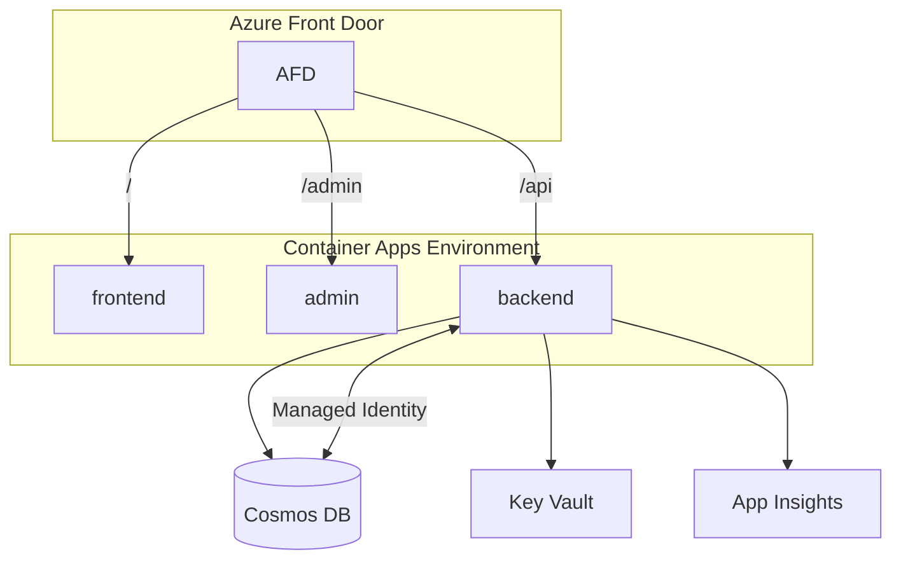

# Architecture

## Runtime topology (Azure)

- **Azure Front Door** — global edge, TLS, WAF, path-based routing.
- **Container Apps** — all three containers (frontend, admin, backend) in the same environment; scale independently.
- **Cosmos DB (SQL API)** — single account, one database, one container (`items`) to start. Provisioned or serverless depending on load profile.
- **Key Vault** — secrets (connection strings, API keys). Container Apps uses user-assigned managed identity to pull.
- **Application Insights** — traces/metrics/logs. Backend ships via OpenTelemetry/Serilog.

## Environments

At minimum `dev` and `prod`. Same Terraform, different `.tfvars`. Optional `staging` for release candidates.

## CI/CD

GitHub Actions:
- **PR checks**: lint + test + build per stack.
- **Main → dev**: build images, push to ACR, deploy via Container Apps revision.
- **Release tag → prod**: same, gated on approval environment.

## Security

- Managed identity over secrets wherever Azure supports it (Cosmos, Key Vault, Storage).
- Admin UI behind Entra ID or IP allowlist at Front Door.
- All containers run as non-root.
