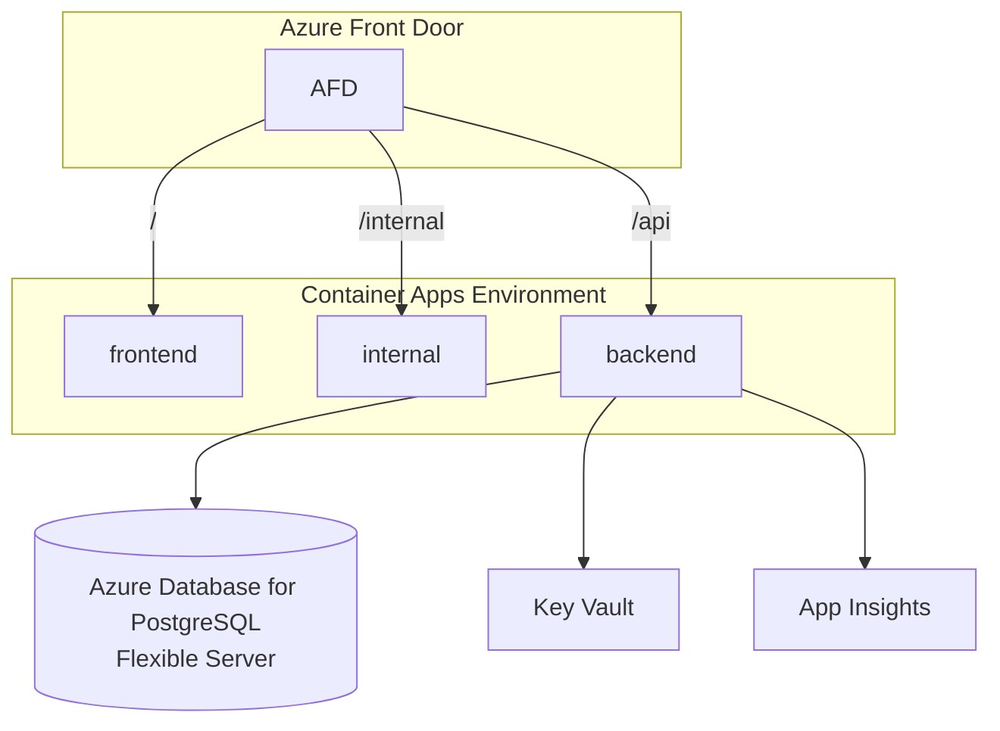

# Architecture

## Runtime topology (Azure)

- **Azure Front Door** — global edge, TLS, WAF, path-based routing.
- **Container Apps** — all three containers (frontend, internal, backend) in the same environment; scale independently.
- **Frontends** — `frontend/` is a Vite + Vue 3 SPA with shadcn-vue and a service worker (PWA). `internal/` is a Next.js 15 App Router app with React 19 and shadcn (React) — runs `node server.js` from a `next build --output standalone` bundle, no nginx layer.
- **Azure Database for PostgreSQL (Flexible Server)** — single server per environment, one database (`projecttemplate`). Connection string injected as a Container App secret. Swap to AAD-token auth via `active_directory_auth_enabled` when ready.
- **Key Vault** — secrets (connection strings, API keys). Container Apps uses user-assigned managed identity to pull.
- **Application Insights** — traces/metrics/logs. Backend ships via OpenTelemetry/Serilog.

## Environments

At minimum `dev` and `prod`. Same Terraform, different `.tfvars`. Optional `staging` for release candidates.

## CI/CD

GitHub Actions:
- **PR checks**: lint + test + build per stack.
- **Main → dev**: build images, push to ACR, deploy via Container Apps revision.
- **Release tag → prod**: same, gated on approval environment.

## Security

- Managed identity over secrets wherever Azure supports it (ACR pull, Key Vault, Storage). Postgres uses password auth by default; flip to AAD auth for production.
- Internal UI behind Entra ID or IP allowlist at Front Door.
- All containers run as non-root.
