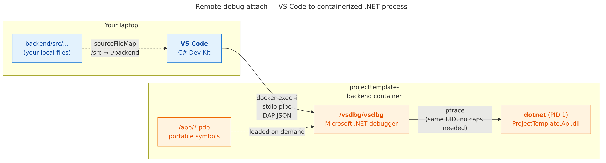

# Step-through debugging inside the backend container

This guide walks you through pausing the running backend at a specific line of code, inspecting variables, and stepping line-by-line — the same experience you'd have debugging a local app, but with the code actually running inside the Docker container. No prior debugger experience required.

---

## The mental model (30 seconds)

When you run `./rebuild.sh`, the backend runs **inside a container**. You can't reach into that container with your IDE the way you would a local process. Instead, we install a small Microsoft tool called **`vsdbg`** into the image. VS Code on your laptop runs `docker exec` under the hood to talk to `vsdbg`, which in turn controls the .NET process. Your breakpoints live in your local source files; vsdbg knows how to translate between the container's view of the code and yours.



Once connected, breakpoints, Step Over (F10), Step Into (F11), variable inspection, and hot call-stack navigation all work exactly like they do locally.

---

## One-time setup

### 1. Install VS Code and the C# Dev Kit

Download [VS Code](https://code.visualstudio.com/). Open the project folder (`/Users/jasonpoley/prj/jp/template`). When VS Code notices the C# files, it will offer to install the **C# Dev Kit** extension — accept. If it doesn't prompt, install it manually:

- Click the Extensions icon in the sidebar (or Cmd+Shift+X)
- Search for "C# Dev Kit"
- Install the one published by **Microsoft**

Alternative: JetBrains **Rider** works too — see "Using Rider instead" at the bottom.

### 2. That's it.

The debugger (`vsdbg`) is already baked into the backend's dev image. The `.vscode/launch.json` in this repo tells VS Code how to attach. You don't configure anything else.

---

## Using it — the 90-second flow

### Step 1. Start the stack

```bash
./rebuild.sh postgres     # or sqlserver
```

Wait for the script to finish. The backend is now running inside `projecttemplate-backend`.

### Step 2. Set a breakpoint

Open `backend/src/ProjectTemplate.Api/Endpoints/ItemEndpoints.cs`. Find a line inside any handler (e.g. the `group.MapPost` block, around line 22). Click in the gutter to the **left** of the line number — a red dot appears. That's a breakpoint.

### Step 3. Attach the debugger

1. Open the **Run and Debug** panel in VS Code (the "play button with a bug" icon in the left sidebar, or Cmd+Shift+D).
2. At the top, you'll see a dropdown — it should already say **"Attach to backend (container)"**. If not, pick it from the list.
3. Press the green **▶** arrow (or F5).
4. A small progress indicator appears at the bottom. Within a few seconds, the status bar turns **orange** — you're attached.

If VS Code asks you to "pick a process", type `dotnet` and press Enter.

### Step 4. Trigger the code

Hit the endpoint that runs through your breakpoint. The easiest way is the admin UI or a curl:

```bash
curl -X POST http://localhost:6180/api/items \
  -H 'Content-Type: application/json' \
  -d '{"partitionKey":"demo","name":"debug-me"}'
```

VS Code snaps to the breakpoint. The current line is highlighted yellow. The left panel shows local variables; the bottom shows the call stack.

### Step 5. Step through the code

Use the floating toolbar at the top of the editor (or the keyboard shortcuts):

| Button | Key | What it does |
| --- | --- | --- |
| ▶ Continue | F5 | Let the code run until the next breakpoint |
| ⤵ Step Over | F10 | Run the current line, stop on the next one |
| ⤴ Step Into | F11 | Follow a function call into its body |
| ⏶ Step Out | Shift+F11 | Run to the end of the current function |
| ◼ Stop | Shift+F5 | Detach the debugger (app keeps running) |

Hover over a variable to see its value. Type any C# expression in the **Debug Console** (bottom panel) to evaluate it in the current scope — e.g. `req.Name` or `DateTime.UtcNow`.

### Step 6. When you're done

Press **Shift+F5** (Stop). This *detaches* the debugger — the backend keeps running normally. You can reattach any time by pressing F5 again; no rebuild needed.

---

## Common gotchas

### "The debugger just sits at 'Attaching...' forever"

Check the backend is actually running:

```bash
docker ps --format '{{.Names}} {{.Status}}' | grep backend
```

You should see `projecttemplate-backend  Up N minutes (healthy)`. If not, run `./rebuild.sh` first.

### "It says my breakpoint is 'unverified' (hollow red dot)"

This usually means the PDB file (debug info) for that code path hasn't been loaded yet. Hit the endpoint once to force the assembly to load, then your breakpoint turns solid. If it never binds:

- Make sure you rebuilt the backend after any code change: `./rebuild.sh --only backend`.
- Confirm the dev image is being used — `docker image inspect projecttemplate-backend --format '{{.Config.User}}'` should show a numeric user ID, and `docker exec projecttemplate-backend ls /vsdbg/vsdbg` should list the binary.

### "I changed a line of code — do I need to reattach?"

Yes, but the flow is fast:

```bash
./rebuild.sh --only backend
```

Then press F5 again in VS Code. The container restarts with your new code in ~10 seconds; you can reattach immediately.

Hot reload / edit-and-continue **does not work** through a container — .NET's hot reload requires a direct process, not a remote attach. For fast inner-loop tweaks, run the backend natively (outside Docker) with the in-memory store:

```bash
cd backend && dotnet run --project src/ProjectTemplate.Api
```

### "My breakpoint fires but I can't see the source code"

VS Code's `sourceFileMap` in `.vscode/launch.json` maps the container's `/src` path back to `${workspaceFolder}/backend`. If you cloned the repo to an unusual path, VS Code handles this automatically via `${workspaceFolder}` — as long as you opened the *repo root* (not a subfolder) in VS Code.

### "Performance feels sluggish when attached"

That's normal. `vsdbg` pauses the process on every step / variable eval. For anything perf-sensitive (load test, profiling), detach first.

### "Can I debug the frontend or admin UI the same way?"

Different story — they run inside the browser, not the container. Use Chrome DevTools (or VS Code's JavaScript debugger against `http://localhost:6173`). This guide is about the .NET backend only.

---

## Under the hood — for when the abstractions leak

- **vsdbg** is Microsoft's VS Code-focused .NET debugger. ~150 KB binary plus a few helper DLLs. Installed into `/vsdbg/` in the container by the Dockerfile's `debug` target via `https://aka.ms/getvsdbgsh`.
- **Debug build config**: `docker-compose.yml` passes `BUILD_CONFIG=Debug` to the Dockerfile. That produces unoptimized IL (clean step-through) and portable **PDB** symbol files (alongside the DLLs in `/app/`).
- **Attach mechanism**: VS Code's C# Dev Kit runs `docker exec -i projecttemplate-backend /vsdbg/vsdbg --interpreter=vscode`, piping DAP JSON messages over stdio. Same user as the .NET process (`APP_UID = 1654` in Microsoft's aspnet image), so same-user ptrace is allowed without special caps.
- **Source map**: The PDBs record compile-time paths like `/src/src/ProjectTemplate.Api/Endpoints/ItemEndpoints.cs` (the container's build dir). `launch.json`'s `sourceFileMap` translates `/src` → `${workspaceFolder}/backend` at runtime, which yields the correct local file.

---

## Production builds are unaffected

The `debug` Dockerfile target is layered *on top of* the `runtime` target. Your CI / Azure Container Apps pipeline should build with `--target runtime` explicitly — no vsdbg, no Debug-config IL, no PDBs. That image is tiny and hardened; the debug image is strictly for `docker-compose up` on a developer's laptop.

```bash
# Production image
docker build --target runtime --build-arg BUILD_CONFIG=Release -t backend:prod backend/
```

---

## Using Rider instead

JetBrains Rider has native support for attaching to a remote .NET process over an SSH-like transport. In Rider:

1. **Run → Edit Configurations → + → .NET Executable → Attach to Process**.
2. Transport: **docker exec**.
3. Container: `projecttemplate-backend`.
4. Rider auto-installs its own remote debug server (`JetBrains.Debugger.Worker`) into the container — no Dockerfile change needed. (It coexists fine with our pre-installed vsdbg.)
5. Rider shows the list of processes in the container; pick `dotnet`.

Same breakpoint / step experience, different keybindings.
