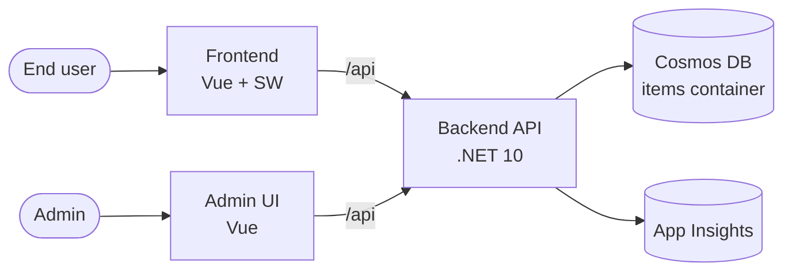

# Design

## System components



## Data model

Single `items` container, partitioned by `/partitionKey`. Documents:

```json
{
  "id": "guid",
  "partitionKey": "tenant-or-user-id",
  "name": "string",
  "description": "string?",
  "createdAt": "ISO-8601",
  "updatedAt": "ISO-8601"
}
```

Partition strategy: choose a partition key that (a) scales horizontally (high cardinality) and (b) matches the query shape — most reads should be within a single partition.

## API surface

| Method | Path | Purpose |
| --- | --- | --- |
| GET | `/api/health` | Liveness |
| GET | `/api/items/{pk}` | List items in partition |
| GET | `/api/items/{pk}/{id}` | Read one item |
| POST | `/api/items` | Create item |
| PUT | `/api/items/{pk}/{id}` | Update item |
| DELETE | `/api/items/{pk}/{id}` | Delete item |

See `/scalar` on the backend in Development for live API docs.

## Key decisions

See `backlog/decisions/` for individual decisions and their rationales (`backlog decision list`).
